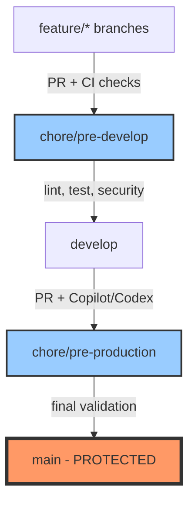

# Git Branch Restructure - Completion Report

**Date:** 2025-10-31  
**Repository:** JR-Drew-Content-Brainstorm  
**Status:** ✅ COMPLETE

---

## Executive Summary

Successfully restructured git branches to implement a CI/CD gate workflow with permanent chore branches. All branches are now synchronized and ready for GitHub Actions configuration.

**Commit SHA:** `50508a06` (all branches synced)

---

## Operations Completed

### ✅ Phase 1: Merge Current Feature Work
- Merged `feat/vite-shadcn-firebase-electron-refactor` → `main`
- Preserved Vite refactor work (2 unique commits)
- Pushed updated main to origin

### ✅ Phase 2: Clean Up Obsolete Branches
- Deleted `feat/forms-rhf-shadcn-firebase` (local + remote)
- Deleted `chore/audit-uxui-20251031-092758` (local only)
- Removed branches with no unique changes

### ✅ Phase 3: Reset Develop to Match Main
- Hard reset `develop` branch to match `main`
- Force pushed to `origin/develop`
- All develop changes now in sync with main

### ✅ Phase 4: Create Permanent Chore Gate Branches
- Created `chore/pre-production` (local + remote)
- Created `chore/pre-develop` (local + remote)
- Reset `feat/vite-shadcn-firebase-electron-refactor` to main

### ✅ Phase 5: Verification Complete
- All branches verified at same commit SHA
- Remote tracking relationships confirmed
- Branch structure successfully established

---

## Current Branch Structure

```
Local Branches:
├── main (protected, tracks origin/main)
├── chore/pre-production (gate branch, tracks origin)
├── develop (tracks origin/develop)
├── chore/pre-develop (gate branch, tracks origin)
└── feat/vite-shadcn-firebase-electron-refactor

Remote Branches:
├── origin/main
├── origin/chore/pre-production
├── origin/develop
├── origin/chore/pre-develop
└── origin/feat/vite-shadcn-firebase-electron-refactor
```

**All branches at commit:** `50508a0612917996914b965ec6b495486dc3613f`

---

## CI/CD Workflow Architecture



### Workflow Description

```
feature/* branches (developer work)
    ↓
    PR + CI checks (lint, test, security)
    ↓
chore/pre-develop (permanent gate branch)
    ↓
    PR + CI checks + Copilot/Codex review
    ↓
develop (main development branch)
    ↓
    PR + CI checks + agent PR handling
    ↓
chore/pre-production (permanent gate branch)
    ↓
    PR + CI checks + final validation
    ↓
main (PROTECTED production branch - ONLY protected)
```

---

## Next Steps Required

### 1. 🔒 Configure GitHub Branch Protection (Manual)

**Navigate to:** GitHub → Settings → Branches → Add rule

**Protect `main` branch ONLY with:**
- ✓ Require a pull request before merging
- ✓ Require approvals (1+)
- ✓ Dismiss stale pull request approvals when new commits are pushed
- ✓ Require status checks to pass before merging
- ✓ Require branches to be up to date before merging
- ✓ Require conversation resolution before merging
- ✓ Include administrators
- ✓ Restrict who can push to matching branches
- ✓ Allow force pushes: NO
- ✓ Allow deletions: NO

**DO NOT protect other branches** - only `main` should be protected.

---

### 2. 🔧 Enable GitHub Actions Workflows

**Current Status:** All workflows disabled (`.yml.disabled` extension)

**Location:** `.github/workflows/`

**Workflows to Re-enable:**

1. **ci.yml** - Main CI pipeline
   ```bash
   mv .github/workflows/ci.yml.disabled .github/workflows/ci.yml
   ```
   - Configure to run on `chore/pre-develop` and `chore/pre-production`
   - Run: ESLint strict mode, TypeScript checks, Vitest tests

2. **functions-ci.yml** - Firebase Functions CI
   ```bash
   mv .github/workflows/functions-ci.yml.disabled .github/workflows/functions-ci.yml
   ```
   - Test Firebase Functions via emulators
   - Validate security rules

3. **docs.yml** - Documentation validation
   ```bash
   mv .github/workflows/docs.yml.disabled .github/workflows/docs.yml
   ```
   - Validate MkDocs builds on PRs

**Example CI Configuration for Chore Branches:**

```yaml
name: Chore Branch CI

on:
  pull_request:
    branches:
      - chore/pre-develop
      - chore/pre-production
      - develop
      - main

jobs:
  lint:
    runs-on: ubuntu-latest
    steps:
      - uses: actions/checkout@v4
      - uses: pnpm/action-setup@v2
        with:
          version: 9.12.0
      - uses: actions/setup-node@v4
        with:
          node-version: 20
          cache: 'pnpm'
      - run: pnpm install
      - run: pnpm lint:strict
      
  typecheck:
    runs-on: ubuntu-latest
    steps:
      - uses: actions/checkout@v4
      - uses: pnpm/action-setup@v2
        with:
          version: 9.12.0
      - uses: actions/setup-node@v4
        with:
          node-version: 20
          cache: 'pnpm'
      - run: pnpm install
      - run: pnpm typecheck
      
  test:
    runs-on: ubuntu-latest
    steps:
      - uses: actions/checkout@v4
      - uses: pnpm/action-setup@v2
        with:
          version: 9.12.0
      - uses: actions/setup-node@v4
        with:
          node-version: 20
          cache: 'pnpm'
      - run: pnpm install
      - run: pnpm test:coverage
      
  python-checks:
    runs-on: ubuntu-latest
    steps:
      - uses: actions/checkout@v4
      - uses: actions/setup-python@v4
        with:
          python-version: '3.10'
      - run: pip install black ruff mypy
      - run: black src/ --check
      - run: ruff check src/
      - run: mypy src/
```

---

### 3. 🤖 Configure Copilot/Codex Integration

**For `chore/pre-develop` and `chore/pre-production` branches:**

1. **GitHub Copilot PR Reviews**
   - Enable automated PR reviews
   - Configure code quality checks
   - Set up security scanning

2. **Agent-based PR Handling**
   - Configure Codex CLI for automated PR review
   - Set up agent workflows for merge decisions
   - Enable automated PR comments and suggestions

3. **Security Scanning**
   - Enable Dependabot alerts
   - Configure CodeQL analysis
   - Set up npm audit / pip audit checks

**Example Copilot Configuration:**

```yaml
name: Copilot PR Review

on:
  pull_request:
    branches:
      - chore/pre-develop
      - chore/pre-production

jobs:
  copilot-review:
    runs-on: ubuntu-latest
    steps:
      - uses: actions/checkout@v4
      - uses: github/copilot-cli-action@v1
        with:
          command: review
          pr-number: ${{ github.event.pull_request.number }}
```

---

### 4. ⚠️ Security Alert Resolution

**Current Status:** 5 moderate vulnerabilities detected

**Action Required:**
1. Visit: https://github.com/Diatonic-AI/jr-drew-content-brainstorm/security/dependabot
2. Review vulnerability details
3. Update affected dependencies
4. Test changes on feature branch
5. Submit PR through new workflow

**Commands to check dependencies:**

```bash
# Node.js dependencies
pnpm audit
pnpm audit fix

# Python dependencies
pip install safety
safety check

# Update package-lock/pnpm-lock
pnpm update
```

---

## Verification Commands

```bash
# Verify all branches are synced
git fetch --all --prune
git branch -vv

# Check commit SHAs
for branch in main develop chore/pre-production chore/pre-develop; do 
  echo "$branch: $(git rev-parse $branch)"
done

# View branch graph
git log --oneline --graph --all --decorate -15
```

---

## Workflow Examples

### Example 1: Feature Development Flow

```bash
# Create feature branch from develop
git checkout develop
git pull origin develop
git checkout -b feat/new-feature

# ... make changes ...

# Push and create PR to chore/pre-develop
git push -u origin feat/new-feature
# Create PR: feat/new-feature → chore/pre-develop

# After CI passes on chore/pre-develop
# Create PR: chore/pre-develop → develop

# After review and approval
# Merge to develop
```

### Example 2: Production Release Flow

```bash
# When develop is ready for production
# Create PR: develop → chore/pre-production

# After CI passes and final validation
# Create PR: chore/pre-production → main

# After review and approval
# Merge to main (triggers production deployment)
```

---

## Branch Maintenance

### Regular Maintenance Tasks

1. **Keep branches in sync:**
   ```bash
   # Update develop from main regularly
   git checkout develop
   git pull origin main
   git push origin develop
   ```

2. **Prune stale branches:**
   ```bash
   git fetch --all --prune
   git branch -vv | grep ': gone]' | awk '{print $1}' | xargs git branch -D
   ```

3. **Review merge conflicts early:**
   ```bash
   git checkout feat/my-feature
   git merge develop  # Test merge before PR
   ```

---

## Troubleshooting

### Issue: Branch out of sync

```bash
# Reset local branch to match remote
git fetch origin
git reset --hard origin/branch-name
```

### Issue: PR conflicts with base branch

```bash
# Update feature branch with latest base
git checkout feat/my-feature
git fetch origin
git merge origin/develop  # or origin/main
# Resolve conflicts
git push origin feat/my-feature
```

### Issue: CI checks failing

```bash
# Run checks locally before pushing
pnpm lint:strict
pnpm typecheck
pnpm test:coverage
black src/ --check
ruff check src/
```

---

## Summary

✅ **Branch restructure complete**  
✅ **All branches synchronized at commit `50508a06`**  
✅ **Ready for CI/CD workflow configuration**  
⚠️ **Manual steps required:** GitHub branch protection + workflow re-enablement  
⚠️ **Security alerts:** 5 vulnerabilities to resolve  

**Status:** Ready for production use after completing manual configuration steps.

---

## Contact & Support

**Repository:** https://github.com/Diatonic-AI/jr-drew-content-brainstorm  
**Documentation:** `docs/` directory  
**WARP Guide:** `WARP.md` (repository orientation)

For questions or issues with this restructure, refer to the WARP.md file or create a GitHub issue.

---

*Report generated: 2025-10-31*  
*Agent: Warp AI Assistant*
