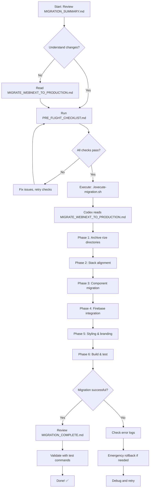

# 📚 Migration Documentation Index

Complete guide for migrating `/apps/web-next` from Next.js to Vite + Production Stack

---

## 🎯 Quick Start (TL;DR)

```bash
cd /home/daclab-ai/Documents/JR-Drew-Content-Brainstorm

# 1. Read the summary
cat MIGRATION_SUMMARY.md

# 2. Run pre-flight checks
bash PRE_FLIGHT_CHECKLIST.md  # Copy/paste commands

# 3. Execute migration
./execute-migration.sh

# 4. Verify success
pnpm --filter @jrpm/web-next build
```

---

## 📖 Documentation Structure

### 1. **MIGRATION_SUMMARY.md** ⭐ START HERE
- **Purpose**: Quick overview of what changes and why
- **Audience**: Everyone
- **Read time**: 5 minutes
- **Contains**: 
  - Problem statement
  - One-command execution
  - Before/after comparison
  - Validation steps

### 2. **PRE_FLIGHT_CHECKLIST.md** ⚠️ RUN BEFORE MIGRATION
- **Purpose**: Safety checks and backups
- **Audience**: Operator running the migration
- **Read time**: 10 minutes (executing: 5 min)
- **Contains**:
  - Git backup steps
  - Dependency verification
  - Disk space checks
  - Rollback procedures

### 3. **MIGRATE_WEBNEXT_TO_PRODUCTION.md** 📋 DETAILED SPEC
- **Purpose**: Complete technical specification for codex CLI
- **Audience**: Codex agent / Technical reviewer
- **Read time**: 20 minutes
- **Contains**:
  - Full migration plan (6 phases)
  - Exact configuration files
  - Component migration patterns
  - Success criteria
  - Post-migration validation

### 4. **execute-migration.sh** 🚀 EXECUTABLE
- **Purpose**: One-command migration execution
- **Audience**: Operator
- **Run time**: ~75 minutes (automated)
- **Contains**:
  - Codex CLI invocation
  - Task specification
  - Progress indicators

### 5. **MIGRATION_INDEX.md** 📚 THIS FILE
- **Purpose**: Navigation and organization
- **Audience**: Everyone
- **Contains**: How to use all docs together

---

## 🗺️ Migration Workflow



---

## 📊 Documentation Quick Reference

| Document | Size | Purpose | When to Use |
|----------|------|---------|-------------|
| `MIGRATION_SUMMARY.md` | 215 lines | Overview & quick ref | First read, quick lookup |
| `PRE_FLIGHT_CHECKLIST.md` | 208 lines | Safety checks | Before execution |
| `MIGRATE_WEBNEXT_TO_PRODUCTION.md` | 598 lines | Full specification | Detailed review, codex input |
| `execute-migration.sh` | 44 lines | Execution script | Running migration |
| `MIGRATION_INDEX.md` | This file | Navigation | Finding the right doc |

**After migration completes:**
- `MIGRATION_COMPLETE.md` - Generated report with before/after details
- `archive/ARCHIVE_LOG.md` - Log of what was archived

---

## 🎯 Use Cases & Recommended Docs

### "I just want to understand what will happen"
→ Read: `MIGRATION_SUMMARY.md`

### "I need to execute the migration now"
→ Follow: 
1. `MIGRATION_SUMMARY.md` (5 min)
2. `PRE_FLIGHT_CHECKLIST.md` (10 min)
3. `./execute-migration.sh` (75 min automated)

### "I need to understand every technical detail"
→ Read: `MIGRATE_WEBNEXT_TO_PRODUCTION.md` (complete specification)

### "Something went wrong, how do I rollback?"
→ Go to: `PRE_FLIGHT_CHECKLIST.md` → **Emergency Rollback** section

### "I want to review what changed after migration"
→ Read: `MIGRATION_COMPLETE.md` (generated after completion)

### "What got archived and why?"
→ Read: `archive/ARCHIVE_LOG.md` (created during migration)

---

## 🔍 Key Information Lookup

### Tech Stack Details
**Source**: `MIGRATION_SUMMARY.md` → "Tech Stack Reference"
- Vite 5.4.10 + React 18.3.1
- TypeScript 5.6.3
- Tailwind CSS 3.4.14
- Full dependency list

### File Structure
**Source**: `MIGRATION_SUMMARY.md` → "Directory Structure After Migration"  
**Source**: `MIGRATE_WEBNEXT_TO_PRODUCTION.md` → "File Structure Target"
- Complete src/ layout
- Config files placement
- Entry points

### Component Migration Patterns
**Source**: `MIGRATE_WEBNEXT_TO_PRODUCTION.md` → "Step 4: Component Migration Pattern"
- Next.js → React Router conversions
- Import replacements
- What to keep vs remove

### Configuration Files
**Source**: `MIGRATE_WEBNEXT_TO_PRODUCTION.md` → "Step 2: Convert Next.js to Vite"
- Full `package.json` with exact versions
- Complete `vite.config.ts`
- Complete `tailwind.config.ts`
- Complete `tsconfig.json`

### Validation Commands
**Source**: `MIGRATION_SUMMARY.md` → "Success Validation"
- Dev server test
- Production build test
- Lint check
- Reference verification

---

## 🚨 Common Questions

**Q: How long does this take?**  
A: ~75 minutes automated. See timeline in `MIGRATION_SUMMARY.md`

**Q: Can I undo this?**  
A: Yes! Three rollback options in `PRE_FLIGHT_CHECKLIST.md` → Emergency Rollback

**Q: What gets deleted?**  
A: Nothing deleted. `rize-*` directories moved to `/archive/` with timestamps.

**Q: Will this affect the production app?**  
A: No. `/apps/web` (production) is unchanged. Only `/apps/web-next` is migrated.

**Q: Do I need to understand all the technical details?**  
A: No. Read `MIGRATION_SUMMARY.md` then run `execute-migration.sh`. Codex handles the details.

**Q: What if I don't have codex CLI?**  
A: Install: `npm install -g @codex-cli/core` (See `PRE_FLIGHT_CHECKLIST.md`)

**Q: Can I run this in stages instead of all at once?**  
A: Not recommended. The spec is designed as atomic operation. But you can manually execute each phase from `MIGRATE_WEBNEXT_TO_PRODUCTION.md` if needed.

---

## 📝 Post-Migration Checklist

After migration completes, verify using these docs:

1. **Check generated report**
   - [ ] Read `MIGRATION_COMPLETE.md`
   - [ ] Verify all phases completed successfully

2. **Run validation commands**  
   From `MIGRATION_SUMMARY.md` → "Success Validation"
   - [ ] `pnpm --filter @jrpm/web-next dev` works
   - [ ] `pnpm --filter @jrpm/web-next build` succeeds
   - [ ] `pnpm --filter @jrpm/web-next lint` passes
   - [ ] No Next.js imports remain

3. **Verify archival**
   - [ ] Check `archive/ARCHIVE_LOG.md` was created
   - [ ] Verify `archive/rize-*` directories exist
   - [ ] Root directory cleaned of rize folders

4. **Test functionality**
   - [ ] Dev server starts on port 3001
   - [ ] Firebase emulators connect (if using)
   - [ ] All routes render correctly
   - [ ] Production build completes

---

## 🎓 Learning Path

### For Quick Execution (30 min total reading)
1. `MIGRATION_SUMMARY.md` (5 min)
2. `PRE_FLIGHT_CHECKLIST.md` (10 min)
3. Run `./execute-migration.sh`
4. Review `MIGRATION_COMPLETE.md` after (15 min)

### For Deep Understanding (60 min total reading)
1. `MIGRATION_SUMMARY.md` (5 min)
2. `MIGRATE_WEBNEXT_TO_PRODUCTION.md` (30 min)
3. `PRE_FLIGHT_CHECKLIST.md` (10 min)
4. Run `./execute-migration.sh`
5. Review `MIGRATION_COMPLETE.md` after (15 min)

### For Technical Review (90 min)
1. All docs in order
2. Review `/apps/web` current implementation
3. Review `/apps/web-next` current implementation  
4. Compare against migration spec
5. Execute migration
6. Code review migrated files

---

## 📞 Getting Help

If stuck:

1. **Check the relevant doc:**
   - Unclear about what changes? → `MIGRATION_SUMMARY.md`
   - Pre-execution issues? → `PRE_FLIGHT_CHECKLIST.md`
   - Technical questions? → `MIGRATE_WEBNEXT_TO_PRODUCTION.md`
   - Execution problems? → `MIGRATION_COMPLETE.md` (if generated)

2. **Gather debug info** (from `PRE_FLIGHT_CHECKLIST.md` → Support Checklist):
   ```bash
   node --version
   pnpm --version
   codex --version
   git status
   ```

3. **Try rollback** (from `PRE_FLIGHT_CHECKLIST.md` → Emergency Rollback)

4. **Review logs** in `MIGRATION_COMPLETE.md` if generated

---

## ✅ Ready to Start?

**Recommended Path:**
1. ✅ Open `MIGRATION_SUMMARY.md` and read it fully
2. ✅ Run through `PRE_FLIGHT_CHECKLIST.md` commands
3. ✅ Execute: `./execute-migration.sh`
4. ✅ Wait for completion (~75 min)
5. ✅ Review `MIGRATION_COMPLETE.md`
6. ✅ Run validation tests from `MIGRATION_SUMMARY.md`

**All documentation is in this directory:**
```
/home/daclab-ai/Documents/JR-Drew-Content-Brainstorm/
├── MIGRATION_INDEX.md                    ← You are here
├── MIGRATION_SUMMARY.md                   ← Start here
├── PRE_FLIGHT_CHECKLIST.md               ← Run before migration
├── MIGRATE_WEBNEXT_TO_PRODUCTION.md      ← Full specification
├── execute-migration.sh                   ← Execute this
└── MIGRATION_COMPLETE.md                  ← Generated after completion
```

---

**Let's migrate! 🚀**
